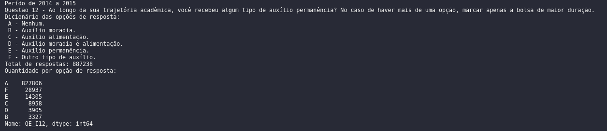
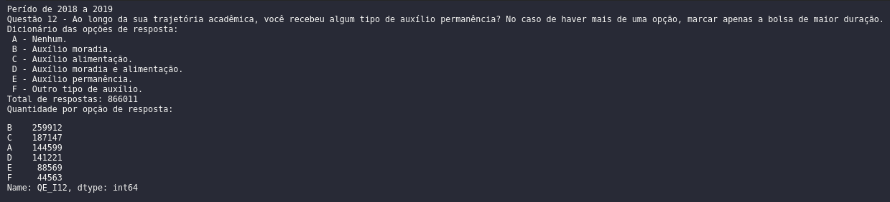

# Enade - 2014 a 2015 e 2018 a 2019
A presente análise pretende comparar os períodos dos dois primeiros anos de governo Dilma, entre 2014 e 2015, e o do Bolsonaro no período que tange 2018 e 2019.

Foi considerado a seguinte pergunta: Qual governo atendeu mais alunos, entre faculdades/universidades/escolas de ensino superior, com algum tipo de auxílio permanência e/ou bolsa acadêmica?

# Fonte dados
A perguntas abaixo foram retiradas do questionário anual do Enade.  
Fonte: https://www.gov.br/inep/pt-br/acesso-a-informacao/dados-abertos/microdados/enade

# Dicionário de dados
## Questão:
código da pergunta: QE_I12.

12. Ao longo da sua trajetória acadêmica, você recebeu algum tipo de auxílio permanência? No caso de haver
mais de uma opção, marcar apenas a bolsa de maior duração.

## opções de respostas:
- A - Nenhum.
- B - Auxílio moradia.
- C - Auxílio alimentação.
- D - Auxílio moradia e alimentação.
- E - Auxílio permanência.
- F - Outro tipo de auxílio.

## Questão:
código da pergunta: QE_I12.

13. Ao longo da sua trajetória acadêmica, você recebeu algum tipo de bolsa acadêmica? No caso de haver
mais de uma opção, marcar apenas a bolsa de maior duração.

## opções de respostas:
- A - Nenhum.
- B - Bolsa de iniciação científica.
- C - Bolsa de extensão.
- D - Bolsa de monitoria/tutoria.
- E - Bolsa PET.
- F - Outro tipo de bolsa acadêmica.

# Resultados
o código fonte está definido com nome de `analise.ipynb`. As seguintes imagem tem objetivo de sintetizar os resultados da análise.

# Considerações
A análise não considerou o contexto social ou econômico dos períodos.

Para futura continuação da análise, a autora tem a pretenção de adicionar informações sobre o sexo, UF e outros auxílios acadêmico.